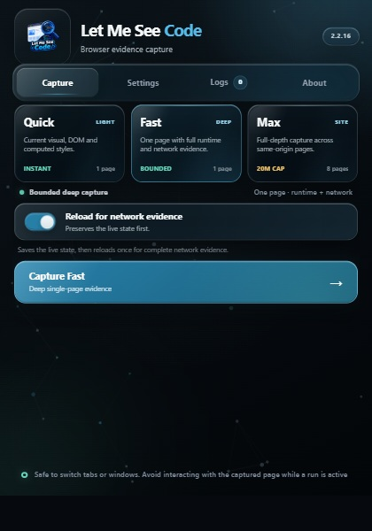
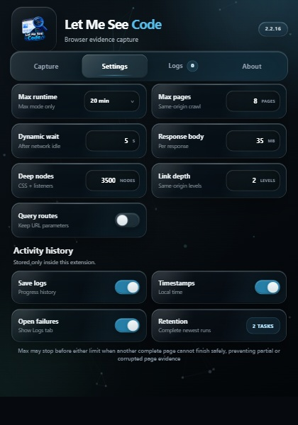
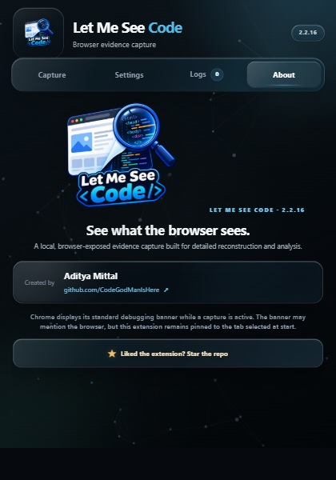

<p align="center">
  
</p>

<h1 align="center">Let Me See Code</h1>

<p align="center">
  <strong>The true tool for viewing source.</strong><br>
  Turn the website Chrome rendered into structured, local, reconstruction-ready evidence.
</p>

<pre align="center">
.:-=+*#%@#*+=-:......................................:-=+*#%@#*+=-:.
::  &lt;&lt; LET ME SEE CODE &gt;&gt;  ::  BROWSER EVIDENCE  ::  LOCAL ZIP  ::
{ DOM }  ::  [ CSS ]  ::  &lt; NETWORK &gt;  ::  ( MOTION )  ::  / MEDIA /
'`~^*+=:;,.!?/\|&lt;&gt;[]{}()#@%$'`~^*+=:;,.!?/\|&lt;&gt;[]{}()#@%$
</pre>

<p align="center">
  <a href="https://github.com/CodeGodManIsHere/Let-Me-See-Code/releases/latest"></a>
  
  
  
  <a href="LICENSE"></a>
</p>

<p align="center">
  <a href="#install">Install</a> ·
  <a href="#modes">Modes</a> ·
  <a href="#evidence">Evidence</a> ·
  <a href="#help">Help</a> ·
  <a href="PRIVACY.md">Privacy</a> ·
  <a href="CHANGELOG.md">Changelog</a>
</p>

<p align="center">
  
</p>

## At a glance

| Question | Answer |
| --- | --- |
| **What does it do?** | Captures browser-exposed DOM, styles, visuals, network, runtime, storage, interaction, animation, media, route, and metadata evidence. |
| **What does it produce?** | A structured ZIP with manifests that explain what completed, what was bounded, and what Chrome could not expose. |
| **Does it upload captures?** | No. Capture staging and ZIP construction stay on your device. |
| **Who is it for?** | Developers, designers, researchers, testers, archivists, and site owners working from rendered browser evidence. |
| **What does it require?** | Google Chrome 118 or newer and one explicit **Load unpacked** installation confirmation. |

## 🌟 Highlights

- **See the rendered page** — preserve live DOM, complete attributes, computed styles, layout, accessibility, screenshots, metadata, and exposed shadow content.
- **Capture more than a snapshot** — Fast and Max collect browser-exposed runtime, network, storage, interaction, animation, canvas, video, and audio-linked evidence.
- **Choose the right depth** — Quick captures the current page, Fast deeply captures one page, and Max crawls eligible same-origin pages.
- **Know what is complete** — every archive explains completed, bounded, skipped, unavailable, and safety-filtered evidence.
- **Keep the work local** — capture staging and ZIP creation happen on your device; no account or hosted upload is required.
- **Get reconstruction-friendly output** — readable paths, manifests, page indexes, deduplication, and completeness reports make each ZIP practical to inspect.

## ℹ️ Overview

Browser **View Source** shows the original response. Modern pages become much richer after JavaScript runs, resources load, components render, and the user scrolls or interacts. Let Me See Code preserves that browser-exposed state as a structured ZIP for inspection, debugging, archiving, and high-fidelity reconstruction work.

It is made for developers, designers, researchers, archivists, testers, and site owners who need more than a screenshot or raw HTML file can provide.

Created by [Aditya Mittal](https://github.com/CodeGodManIsHere).

> [!IMPORTANT]
> Let Me See Code captures evidence Chrome exposes to the selected tab and debugging interfaces. It cannot recover private backend source, databases, deployment secrets, DRM-protected media, closed shadow roots, or information the browser never receives.

<a id="install"></a>

## ⬇️ Install

### Windows assisted setup

The repository includes [`install-windows.bat`](install-windows.bat). It:

1. checks for Git;
2. clones or safely updates the repository in `%LOCALAPPDATA%\Let-Me-See-Code`;
3. verifies `manifest.json`;
4. copies the extension folder path to the clipboard; and
5. opens both the folder and `chrome://extensions`.

Chrome deliberately requires the last confirmation for unpacked extensions:

1. turn on **Developer mode**;
2. click **Load unpacked**; and
3. paste the copied folder path and select it.

The helper requires [Git for Windows](https://git-scm.com/download/win). Read scripts before running them—the complete helper is visible in this repository.

> [!NOTE]
> A normal `.bat` file cannot silently install a persistent unpacked extension into someone’s personal Chrome profile. That restriction protects users from programs installing extensions without permission. A true one-click, automatically updated installation requires publishing through the Chrome Web Store. Administrator-managed enterprise installation is also possible, but it is not suitable for ordinary users.

### Manual installation

**Requirement:** Google Chrome 118 or newer.

1. Download `Let-Me-See-Code-v2.2.16.zip` from the [latest release](https://github.com/CodeGodManIsHere/Let-Me-See-Code/releases/latest).
2. Extract it into a permanent folder.
3. Open `chrome://extensions`.
4. Enable **Developer mode**.
5. Click **Load unpacked**.
6. Select the folder containing `manifest.json`.
7. Pin **Let Me See Code** from Chrome’s Extensions menu.

The selected folder should look like this:

```text
Let-Me-See-Code-v2.2.16/
├── manifest.json
├── popup.html
├── popup.css
├── popup.js
├── service_worker.js
├── page_extractor.js
├── page_instrumentation.js
├── offscreen.html
├── offscreen.js
├── assets/
└── vendor/
```

Keep the extracted folder in place. Chrome loads the unpacked extension directly from it.

## 🚀 Your first capture

1. Open the page you want to preserve.
2. Close DevTools on that tab—Chrome permits only one debugger connection at a time.
3. Open Let Me See Code.
4. Choose **Quick**, **Fast**, or **Max**.
5. For Fast, leave **Reload for network evidence** enabled when load-time requests matter. The current live state is preserved before reloading.
6. Click **Capture**.
7. You may switch tabs or windows, but avoid interacting with the captured page while the run is active.
8. Wait for the ready message. The ZIP is saved through Chrome Downloads.

A finished archive uses a readable name such as:

```text
let-me-see-code-example.com-max.zip
```

During longer runs:

- **Pause** takes effect at the next safe checkpoint, after the current evidence file is protected.
- **Resume** continues the same run; paused time does not count against the selected Max runtime.
- **Cancel** detaches cleanly, removes unfinished archive data, and hides the progress display.
- Closing the popup does not lose active progress or locally stored activity history.

<a id="modes"></a>

## 📦 Capture modes

| Mode | Best for | Scope | What to expect |
| --- | --- | --- | --- |
| **Quick** | A fast visual and structural snapshot | Current page, no reload | Rendered DOM, computed styles, layout, accessibility, current visual, metadata, forms, media references, and low-cost dynamic state |
| **Fast** | Deep inspection or reconstruction of one page | One page, optional reload | Quick evidence plus network, runtime, assets, scripts, storage, interactions, responsive states, animations, media, and performance |
| **Max** | Mapping a same-origin website | Configurable pages and runtime | Full-depth page evidence, safe route discovery, origin-wide evidence, crawl records, deduplication, and archive-wide completeness reporting |

Max runtime and page values are **upper limits, not quotas**. Max can finish earlier when there are no more eligible routes, the remaining routes are duplicates or safety-filtered, the configured link depth is exhausted, or another complete page cannot be captured and finalized safely within the remaining time.

<a id="evidence"></a>

## 🔎 What it captures

Actual coverage depends on the selected mode, page behavior, Chrome support, permissions, limits, and what the website exposes.

| Evidence | Quick | Fast | Max |
| --- | :---: | :---: | :---: |
| Rendered DOM, attributes, datasets, ARIA relationships, slots, and open shadow roots | ✓ | ✓ | ✓ per page |
| Computed styles, layout, accessibility tree, MHTML, and screenshots | ✓ | ✓ | ✓ per page |
| CSS rules, custom properties, layers, container queries, `@scope`, and registered properties | Basic | ✓ | ✓ per page |
| Network requests, response metadata, eligible bodies, WebSockets, and event streams | — | ✓ | ✓ |
| Scripts, source maps, WebAssembly, and bounded derived source analysis | — | ✓ | ✓ |
| Images, responsive sources, fonts, media sources, tracks, and codecs | ✓ | ✓ | ✓ |
| Animation definitions, timing, keyframes, playback state, and timeline samples | Current state | ✓ | ✓ per page |
| Lazy content, nested scrolling, pointer states, canvas, video, and audio-linked motion | Probe | ✓ | ✓ per page |
| Metadata, JSON-LD, social cards, canonical links, manifests, and installability | ✓ | ✓ | ✓ |
| Navigation, paint, layout-shift, long-task, and resource timing | Basic | ✓ | ✓ |
| Storage inventories, Cache/IndexedDB/OPFS schemas, and quota information | — | ✓ | ✓ once per origin |
| CSP, Permissions Policy, isolation, referrer policy, and security metadata | — | ✓ | ✓ |
| Framework markers, bootstrap state, history state, and route hints | Basic | ✓ | ✓ |
| Form validation and control relationships without deliberately collecting entered values | ✓ | ✓ | ✓ |
| Safe same-origin route discovery and crawl graph | — | — | ✓ |

### Animation and media evidence

Where Chrome and the page expose it, Fast and Max can preserve:

- CSS and Web Animations keyframes, timing, easing, playback rate, progress, animated properties, and targets;
- before, active, and after timeline checkpoints with ordered viewport frames;
- document, nested, and virtual scroll-surface scenes;
- safe hover, focus, active, tab, accordion, menu, and disclosure states;
- canvas snapshots plus WebGL and WebGPU activity metadata;
- responsive mobile, tablet, and desktop states;
- video configuration and bounded playback checkpoints; and
- media lifecycle, Web Audio graph topology, parameter automation, and bounded analyser summaries.

The extension does not record microphone input, retain decoded raw audio samples, bypass DRM, or read protected/tainted canvas pixels.

## 🗂️ Understanding an archive

Deep archives vary by site, but these are the best files to open first:

1. `capture_manifest.json` — target, mode, configuration, timing, and headline counts.
2. `capture_completeness.json` — completed layers, bounded stages, unavailable evidence, and known gaps.
3. `WARNINGS.json` — unsupported Chrome features and exact partial-coverage reasons.
4. `site/crawl_manifest.json` — discovered, captured, redirected, skipped, duplicate, and safety-filtered routes in Max.
5. Each page’s `visual_manifest.json` — measured page area, visual coverage, and image paths.

A Max archive commonly resembles:

```text
let-me-see-code-example.com-max.zip
├── capture_manifest.json
├── capture_completeness.json
├── WARNINGS.json
├── site/
│   ├── crawl_manifest.json
│   └── pages/
│       ├── 000_home/
│       │   ├── current_state/
│       │   ├── reloaded/
│       │   ├── cdp/
│       │   ├── forensics/
│       │   ├── visual_manifest.json
│       │   └── visual_tiles/
│       └── 001_about/
├── network/
│   ├── network.har.json
│   ├── body_manifest.json
│   ├── bodies/
│   └── security_policy_headers.json
├── forensics/
│   ├── scripts/
│   ├── source_maps/
│   ├── wasm/
│   └── targets/
└── deduplication_manifest.json
```

## ✨ Interface

<table>
  <tr>
    <td align="center"><br><sub><strong>Capture</strong> — mode, progress, Pause/Resume, Cancel, and completion</sub></td>
    <td align="center"><br><sub><strong>Settings</strong> — runtime, pages, depth, evidence limits, and history</sub></td>
    <td align="center"><br><sub><strong>About</strong> — project identity, author, browser note, and repository</sub></td>
  </tr>
</table>

The popup fits Chrome’s compact extension window without scrolling on Capture, Settings, and About. Logs can scroll when a run has a long history. The interface includes translucent glass surfaces, drag-and-spring tab and switch interactions, and a short pixel trail from either logo.

## 🧪 v2.2.16 benchmark

The final test matrix covered static pages, documentation, framework applications, forms, modern landing pages, news, e-commerce, social platforms, video, and animation-focused experiences.

- **29** requested targets across **3** modes
- **87** requested site/mode combinations
- **81 passing combinations** across all **27 reachable targets**
- **62 fresh runs** during the v2.2.16 matrix
- Valid ZIP output for every fresh successful Fast and Max capture
- No page crashes in those successful Fast and Max runs
- Zero recorded extension or service-worker runtime errors in those successful runs

Two targets were unreachable because of external TLS and DNS failures before the extension could run. See the release notes for the full benchmark and limitations.

## 🔒 Privacy and safety

- Capture processing and ZIP construction happen locally.
- The extension does not request permanent `<all_urls>` host permission.
- Access begins from the tab you explicitly select.
- Known cookie values, reusable authorization values, password fields, secret fields, and CSRF values are masked or reduced where possible.
- Form rules and relationships are captured without deliberately collecting entered values.
- Max limits crawling to eligible same-origin pages and filters routes associated with logout, deletion, purchases, authentication, account changes, subscriptions, and similar actions.
- Safe UI exploration avoids form submission and controls with destructive or transactional wording.

No automatic redactor can understand every website. Screenshots, application state, page text, unusual field names, or network payloads may still contain sensitive or copyrighted material. **Review every archive before sharing it.** Read [PRIVACY.md](PRIVACY.md) for details.

## Honest boundaries

A highly accurate visual reconstruction is sometimes possible. A guaranteed perfect functional clone is not.

Let Me See Code cannot obtain:

- private backend source, databases, or server-only business logic;
- environment variables, signing keys, deployment settings, or private APIs;
- application states and routes the current browser session never exposes;
- closed shadow-root internals or inaccessible cross-origin frame contents;
- DRM-protected media or protected canvas pixels;
- every moment of an infinite, random, user-generated, physics-driven, or server-driven animation; or
- legal permission to reuse captured code, fonts, media, trademarks, or content.

Think of the result as a **high-depth browser-evidence archive**, not proof that every hidden part of a website was captured.

<a id="help"></a>

## 🛠️ Troubleshooting

| Problem | Likely reason | What to do |
| --- | --- | --- |
| Capture remains at **Attaching Chrome tools** | DevTools or another automation tool may own the tab’s debugger connection | Close DevTools for that tab, disconnect other automation, reload, and retry |
| Chrome internal page cannot be captured | Chrome protects `chrome://` and other privileged pages | Use a normal `http://`, `https://`, or permitted `file://` page |
| Max stops before its limits | Limits are ceilings; routes may be exhausted, duplicated, depth-bounded, safety-filtered, or unsafe to begin near finalization | Read `capture_completeness.json` and `site/crawl_manifest.json` |
| A stage says **bounded** or **partial** | An expensive optional collector reached a stability boundary | Read its manifest and `WARNINGS.json` before raising the relevant setting |
| Page changed during capture | The page or user interaction changed its live state | Run again and leave the target page untouched; switching tabs is safe |
| ZIP takes time to appear | Chrome is finalizing and starting a large download | Keep Chrome open and check the final packing lines in Logs |
| WebSQL or DOM-counter warning appears | That legacy/diagnostic Chrome domain is unavailable in the current browser | No action is normally required; the extension records it and continues |
| Earlier network responses are missing in Fast | They completed before the extension attached | Enable **Reload for network evidence** and capture again |

When reporting a problem, include the extension version, Chrome version, operating system, mode, settings, copied Logs, and—when safe—`capture_completeness.json` plus `WARNINGS.json`.

## Permissions

| Permission | Purpose |
| --- | --- |
| `activeTab` | Access the page selected when you open the extension |
| `debugger` | Read Chrome-exposed DOM, CSS, network, performance, storage, accessibility, and runtime evidence |
| `downloads` | Save the finished ZIP |
| `offscreen` | Assemble large archives outside the short-lived popup |
| `scripting` | Install bounded page collectors and read exposed state |
| `storage` | Keep settings, progress, and the two newest task logs locally |
| `unlimitedStorage` | Stage large captures without a small extension quota corrupting the archive |

## Updating

With the Windows helper, run `install-windows.bat` again, then click **Reload** for Let Me See Code in `chrome://extensions`.

For a manual installation:

1. download and extract the new release;
2. replace the old extension files or select the new permanent folder;
3. open `chrome://extensions`; and
4. click **Reload**, or remove the old unpacked copy and use **Load unpacked** again.

## Development

Let Me See Code is a plain Manifest V3 extension. No build step is required for normal development.

```text
manifest.json              Extension declaration and permissions
popup.html / .css / .js    Popup interface and local settings
service_worker.js          Capture orchestration, crawling, and archive assembly
page_extractor.js          Page-level evidence collection
page_instrumentation.js    Early runtime and performance observation
offscreen.html / .js       Incremental ZIP staging
vendor/                    Bundled libraries and license files
tools/                     Validation and self-tests
```

Run the included checks with a current Node.js release:

```bash
node tools/validate.mjs
node tools/selftest.mjs
```

Then reload the unpacked extension and test Quick, Fast, and Max on both a simple page and a dynamic page.

## 💭 Feedback and contributing

Bug reports, focused feature requests, documentation improvements, and pull requests are welcome.

- Open an [issue](https://github.com/CodeGodManIsHere/Let-Me-See-Code/issues) for reproducible bugs or suggestions.
- Read [CONTRIBUTING.md](CONTRIBUTING.md) before preparing a code change.
- Report vulnerabilities privately using the instructions in [SECURITY.md](SECURITY.md).
- Include exact steps, expected and actual behavior, mode, settings, and copied Logs.
- Share only archives or diagnostic files you have reviewed and are authorized to disclose.

Contributions should preserve the project’s core promises: deep browser-exposed evidence, explicit completeness reporting, recoverable stages, local processing, safe crawling, and no silent shallow fallback in Max.

## Responsible use

Use Let Me See Code only on websites you own or are authorized to inspect, test, archive, or reconstruct. The ability to view or download material does not grant permission to republish it. You are responsible for respecting privacy, copyright, trademarks, access controls, terms of service, and applicable law.

## License

Let Me See Code is released under the [MIT License](LICENSE). Captured website material remains subject to its own rights and restrictions.

## Credits

Created by [Aditya Mittal](https://github.com/CodeGodManIsHere).

ZIP creation uses [fflate](https://github.com/101arrowz/fflate). JavaScript parsing and printing use [Acorn](https://github.com/acornjs/acorn) and [Astring](https://github.com/davidbonnet/astring). WebAssembly text conversion uses [WABT](https://github.com/WebAssembly/wabt). Bundled license files live beside each library in `vendor/`.

---

<p align="center">
  <strong>Like the project? <a href="https://github.com/CodeGodManIsHere/Let-Me-See-Code">★ Star the repository</a></strong>
</p>
